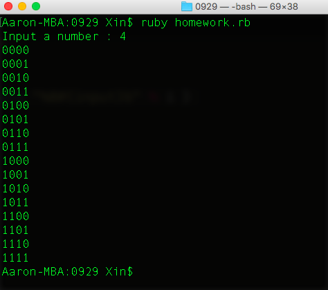

# 資料結構實習

## 資訊二丙 D0282187 楊竑昕

### 題目 : 輸出 0000~1111 的排列組合

### 題目定義 

- 題意說明：撰寫一程式，輸出0和1的所有排列變化。
- 程式說明：輸入一個數字x，輸出x個bits所有0和1的變化。

### 程式碼

~~~ ruby
print "Input a number : "
input = gets.chomp.to_i
number = 2**(input)-1
(number+1).times { |i| puts "%0#{input}b" % i }
~~~

### 執行結果

### 遭遇困難

`puts("%0#{input}b" % i)`這一段程式碼是上網google查詢的，因為不知道Ruby的2進制輸出方法。

### 心得

很喜歡功課有這種動動腦的題型，寫解題型的程式讓人很有成就感!
